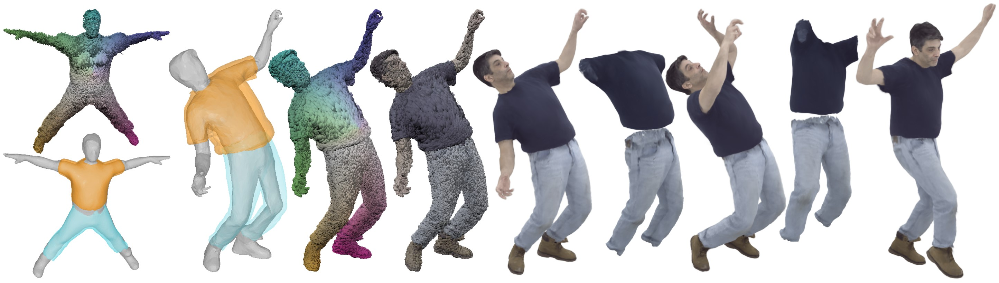

<h2 align="center"><b>D3GA - Drivable 3D Gaussian Avatars</b></h2>

<h4 align="center"><b>
    <a href="https://zielon.github.io/" target="_blank">Wojciech Zielonka</a><sup>1,2,3*</sup>, 
    <a href="https://scholar.google.ch/citations?user=oLi7xJ0AAAAJ&hl=en" target="_blank">Timur Bagautdinov</a><sup>3</sup>, 
    <a href="https://shunsukesaito.github.io/" target="_blank">Shunsuke Saito</a><sup>3</sup>, 
    <a href="https://zollhoefer.com/" target="_blank">Michael Zollhofer</a><sup>3</sup><br>
    <a href="https://justusthies.github.io/" target="_blank">Justus Thies</a><sup>1,2</sup>, 
    <a href="https://scholar.google.com/citations?user=Wx62iOsAAAAJ&hl=en" target="_blank">Javier Romero</a><sup>3</sup>
</b></h4>

<h6 align="center">
    <sup>1</sup><i>Max Planck Institute for Intelligent Systems, Tübingen, Germany</i><br>
    <sup>2</sup><i>Technical University of Darmstadt  </i>
    <sup>3</sup><i>Meta</i>
</h6>

<h4 align="center">
<a href="https://youtu.be/C4IT1gnkaF0" target="_blank">Video&nbsp</a>
<a href="https://arxiv.org/pdf/2311.08581.pdf" target="_blank">Paper&nbsp</a>
<a href="https://github.com/facebookresearch/goliath?tab=readme-ov-file#data" target="_blank">Dataset&nbsp</a>
<a href="https://zielon.github.io/d3ga/" target="_blank">Website&nbsp</a>
</h4>

<div align="center"> 

<i style="font-size: 1.05em;">Official Repository for D3GA - Drivable 3D Gaussian Avatars</i>
</div>
<br>

### Installation

Please follow these steps to install the repository and the required libraries: first, clone the repository along with its submodules; then, create the environment and install all necessary dependencies.

```
git clone --recursive https://github.com/facebookresearch/D3GA.git
cd D3GA
git submodule update --init --recursive
```

After the repository is recursively cloned with all the submodules, we can create the environment and install the libraries.

```
conda create -n d3ga python=3.9 -y
conda activate d3ga
./install.sh
```

### Datasets

We used two datasets, [ActorsHQ](https://github.com/synthesiaresearch/humanrf) and [Goliath](https://github.com/facebookresearch/goliath) (ClothedBody). Please follow official download instructions to obtain the training images. We provide dataloaders which support those two datasets.

### Additonal Assets

We use assets such as garment cages for **Goliath**, additional tracking, and segmentation masks for **ActorsHQ**, provided by Wojciech Zielonka (TU Darmstadt), available under [Goliath](https://drive.google.com/drive/folders/15Z7WMKPB3p1boaRgUkkgZ6i2Ig7iW6jI?usp=sharing) and [ActorsHQ](https://drive.google.com/drive/folders/1bVH0fh2CmwrD8_rozwGn8fNLi6dMFsrF?usp=sharing) links. In the configs you then specify for instance `assets: datasets/D3GA/actorshq/` or `assets: datasets/D3GA/goliath/`.

The **ActorsHQ** dataset contains **camera parameters, SMPL-X parameters, and segmentation masks**. To successfully train, one needs to provide images and alpha masks from the dataset.  

See the exemplary configuration file: `actorshq_actor02.yml`.

After downloading the corresponding assets for each actor in a given dataset (Goliath or ActorsHQ), please specify the paths in the configuration file.

The SMPL-X model can be found at the following link [SMPL_python_v.1.1.0](https://smpl-x.is.tue.mpg.de/download.php) (the first option). Please note that you need to create an account to access the models.

Afterward, set the following paths in the configuration file:

```
smplx_topology: ${smplx_dir}/SMPL_python_v.1.1.0/smplx/models/SMPLX_NEUTRAL.npz
smplx_model: ${smplx_dir}/SMPL_python_v.1.1.0/smplx/models/SMPLX_NEUTRAL.pkl
```

In the case of generating your own assets, such as cages for each garment piece, please follow the instructions below.

###  Training

Training is strightforward and requires only specifying confing for the `train.py`.

For instnace.
```
# Goliath Dataset
python train.py configs/goliath_axe184.yml

# ActorsHQ Dataset
python train.py configs/actorshq_actor02.yml 
```

To run default testing you can use `test.py`. It will generate the output frames and video.
```
python test.py configs/goliath_axe184.yml
python test.py configs/actorshq_actor02.yml 
```

### Cage generation

To generate cages for a new sequence we need to first create a mesh with segmentation. Meaning, we need to backproject segmentation maps onto the mesh faces such that for each face we have a corresponding segmentation label. `segmentation.py` script samples random images from the dataset and returns topology with color corresponding to the given label such that we can easily crop the mesh according to the label `(upper, lower, etc)`.

The cage generation (cropping the mesh according to the segmentation and generating tetrahedron) is fully automatic. However, most of the time it requires manual inspection and a MeshLab post-cleaning algorithm (unfortunately). The latter step is very important because in most of the cases the simplification algorithm after marching cubes creates self-intersection faces which will cause the tetrahedralization process to explode. Thus for each garment cage you need to:

#### First breakpoint

Open `mc_source.ply` from your output folder (it is specified in the config file as `assets`) in MeshLab see if the mesh is correct after cropping based on the segmentation mask. (You might need to close small holes or remove some outliers).

#### Second breakpoint

We need to remove all the self-intersecting faces using MashLab. Open `cage.ply` in MeshLab from the `assets` folder and use Taubin Smooth with default parameters. It will smooth the cage for the last time and remove all self-intersection faces as a post-cleaning step.

### License
D3GA is Attribution-NonCommercial 4.0 International licensed, as found in the LICENSE file.

### Citation
If you use this project in your research please cite D3GA:
```bibtex
@article{zielonka25dega,
  title        = {Drivable 3D Gaussian Avatars},
  author       = {Wojciech Zielonka and Timur Bagautdinov and Shunsuke Saito and 
                  Michael Zollhöfer and Justus Thies and Javier Romero},
  booktitle    = {International Conference on 3D Vision (3DV)},
  month        = {March},
  year         = {2025}
}
```

*Work done while Wojciech Zielonka was an intern at Codec Avatars Lab, Meta, Pittsburgh, PA, USA
